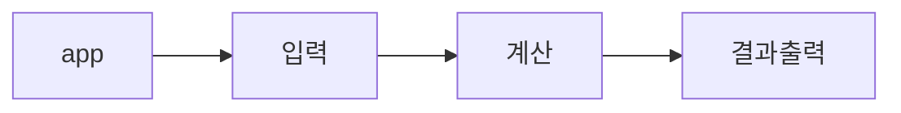

# ☕ Class 1

 

 
 

 
 

 
 

 
 
2023.07.09 ~ 2023.07.15

### 🎯  기능 요구 사항

---

> 2개의 정수 합을 구해주는 계산기를 만들어야 한다.
>

### 🚀 제한 사항

- 좋은 변수명 짓기
- 한 메서드의 라인 수는 최대 10줄로 제한한다.
- 한 메서드는 오직 1가지의 일만 수행하도록 한다.
- 들여쓰기는 최대 2회까지만 가능하다.
- if 문 사용시 else 예약어를 사용하지 않는다.
- 메서드의 파라미터는 최대 3개까지만 허용한다.
- 필드의 수를 최소화 한다.
- 테스트 케이스도 직접 만들어 통과시킨다.

### 🤔 생각해 볼 것들

- 계산기는 덧셈외에도 다른 기능들이 있다. 변경과 수정이 용이한가?
- TDA, 디미터의 법칙
- 좋은 OOP

### 🧮 실행 결과 예시

| 첫번째 정수 | 두번째 정수 | Result |
| --- | --- | --- |
| 13 | 5 | 18 |
| -5 | 1 | -4 |

 
 

### References

---

[객체지향 생활 체조 총정리](https://developerfarm.wordpress.com/2012/02/03/object_calisthenics_summary/) 
[디미터 법칙(Law of Demeter)과 묻지 말고 시켜라(Tell, Don’t Ask)](https://prohannah.tistory.com/204) 
[하나의 메서드는 하나의 기능을 수행하자](https://tecoble.techcourse.co.kr/post/2020-05-10-single-job-method/) 
[좋은 코드를 위한 자바 변수명 네이밍](https://tecoble.techcourse.co.kr/post/2020-04-24-variable_naming/) 
[원시 타입을 포장해야 하는 이유](https://tecoble.techcourse.co.kr/post/2020-05-29-wrap-primitive-type/) 
[[이펙티브 자바] 아이템 2. 생성자에 매개변수가 많다면 빌더를 고려하라](https://velog.io/@lychee/이펙티브-자바-아이템-2.-생성자에-매개변수가-많다면-빌더를-고려하라) 