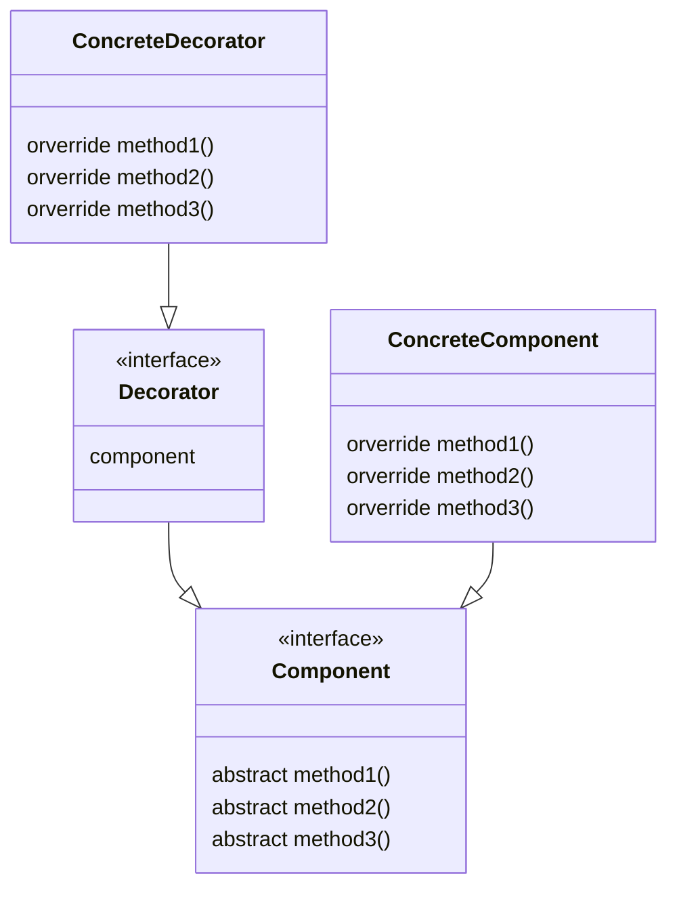

# Decorator

중심이 되는 클래스가 있고 거기에 장식이 되는 기능들을 하나씩 추가해 목적에 맞는 클래스로 만들어 가는 것. 

## Component 역

기능을 추가할 때 핵심이 되는 역할. (interface) 

## ConcreteComponent 역

Component 의 구체적인 구현체 

## Decorator(장식자) 역

Component 와 동일한 API 를 가지며, 
이 Decorator 가 장식할 대상이 되는 Component 도 가지고 있다. 

## ConcreteDecorator(구체적인 장식자) 역

구체적인 Decorator

