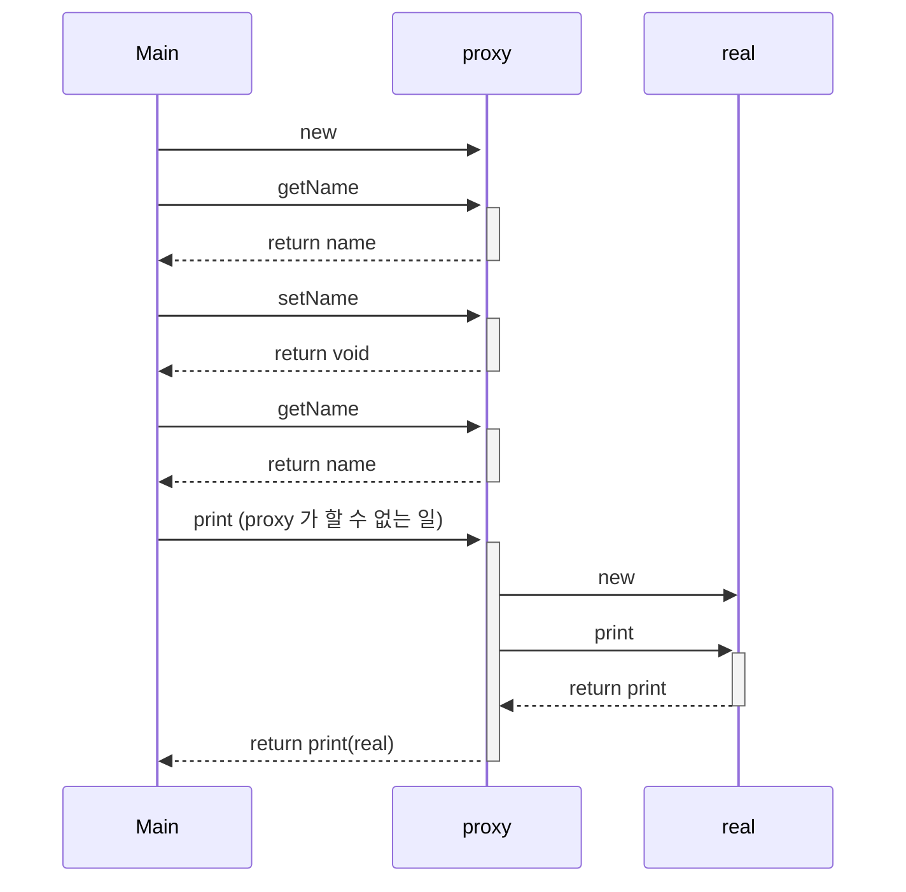

# Proxy

본인(real)이 아니어도 할 수 있는 일을 대리인(proxy)으로 대체하고 
대리인(proxy)이 할 수 없는 순간에 본인(real)이 처리하도록 하는 패턴 

## Subject(본인)

`Proxy` 와 `RealSubject` 를 동일시하기 위한 API. 

## Proxy(대리인)

`Client` 의 요청을 최대한 처리. 
처리할 수 있는 범위를 넘어서면 `RealSubject` 에게 처리를 요청 

## RealSubject(본인)

`Proxy` 만으로 감당할 수 없을 때 등장 